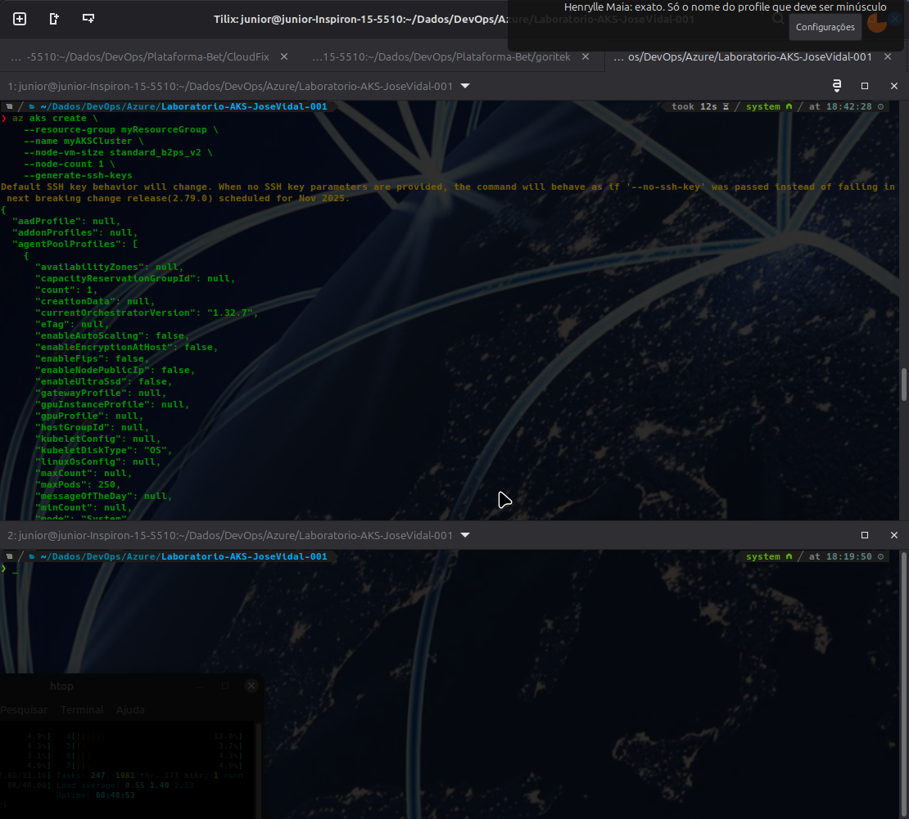
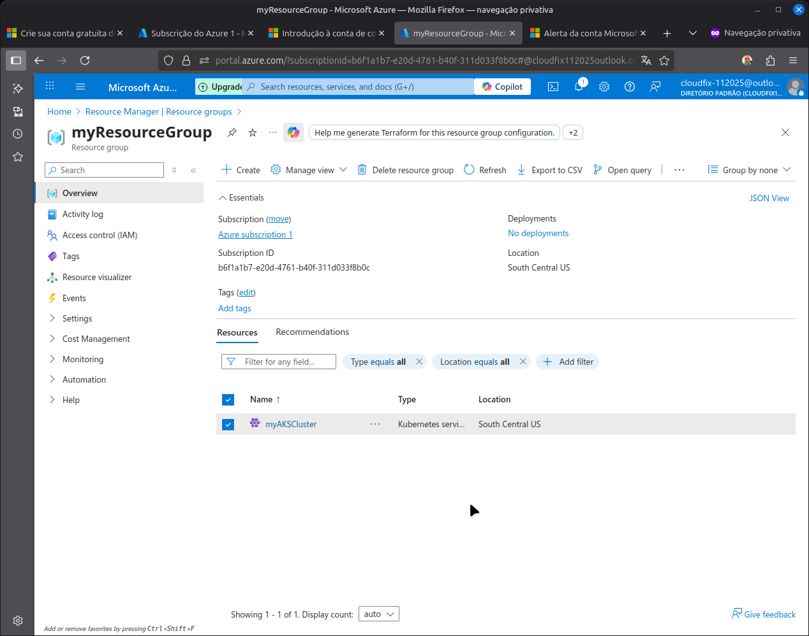
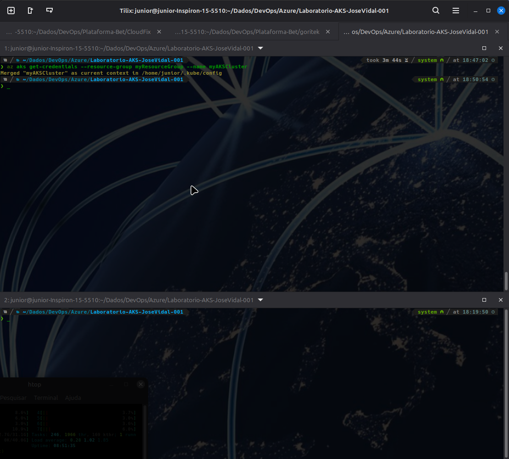
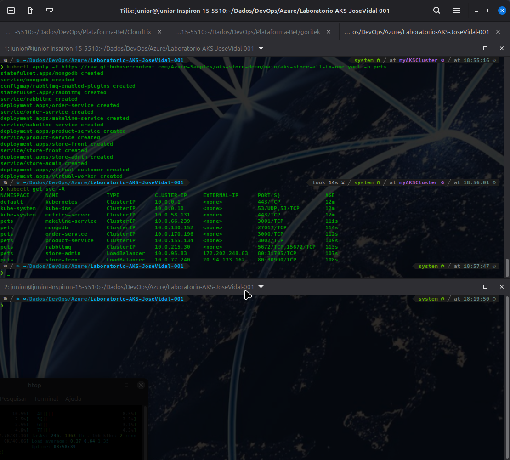
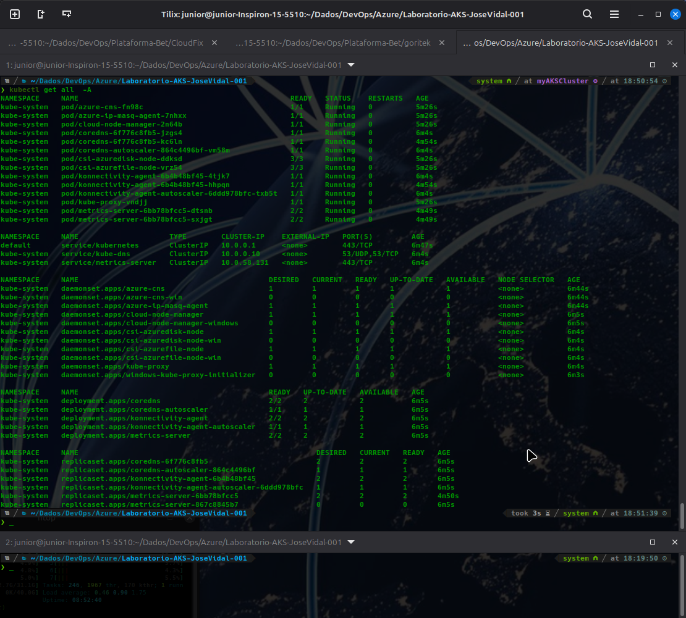
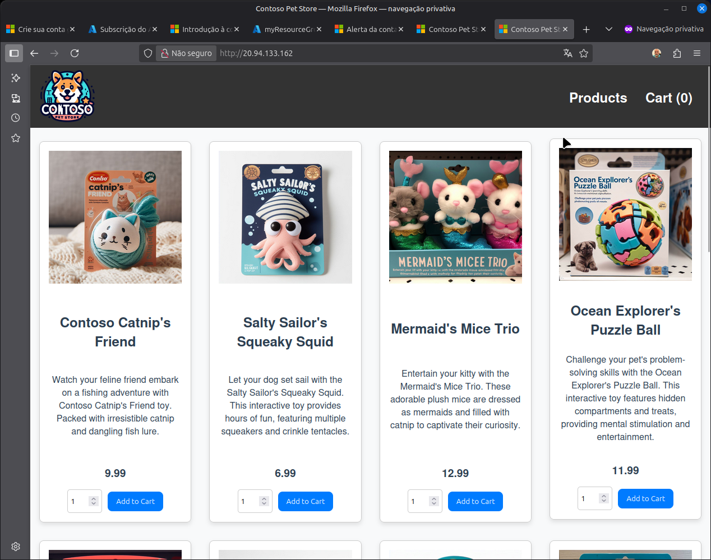
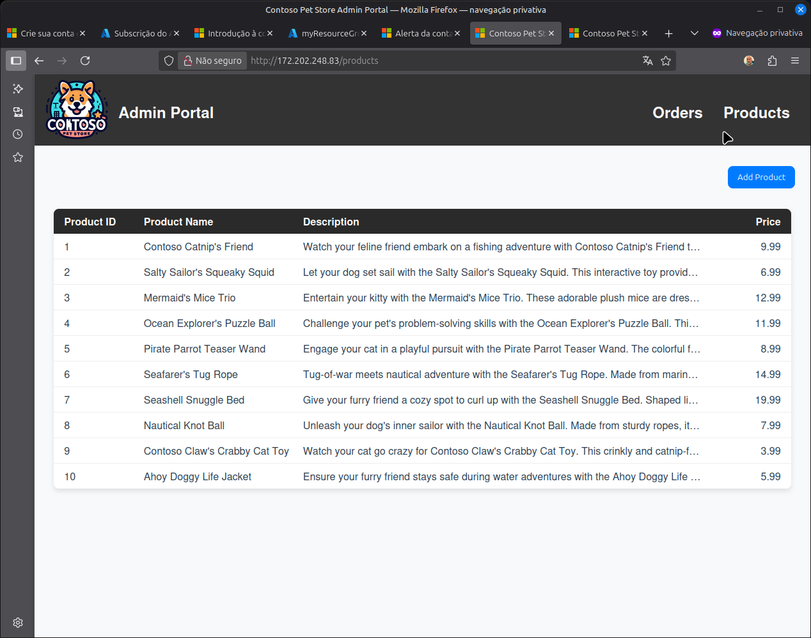

# Laboratório AKS Store Demo - Minha Jornada de Aprendizagem

## 1. Objetivo

Este repositório documenta minha jornada prática de estudo e execução do projeto de demonstração [AKS Store Demo](https://github.com/Azure-Samples/aks-store-demo). O objetivo foi aprofundar meus conhecimentos em tecnologias de nuvem e DevOps, recriando passo a passo o provisionamento da infraestrutura no Microsoft Azure e a implantação de uma arquitetura complexa de microserviços no Serviço de Kubernetes do Azure (AKS).

Este documento serve como um registro detalhado do processo, das tecnologias empregadas e dos aprendizados adquiridos, refletindo meu compromisso com o aprendizado contínuo e a aplicação prática de conceitos modernos de engenharia de software.

## 2. Arquitetura da Solução

O projeto simula uma aplicação de e-commerce baseada em uma arquitetura de microserviços poliglota, onde cada serviço é desenvolvido com a tecnologia mais adequada para sua função. A comunicação entre os serviços é gerenciada de forma assíncrona, e a infraestrutura é totalmente provisionada como código.

## 3. Tecnologias e Recursos Utilizados

Esta jornada envolveu um ecossistema rico e moderno de tecnologias e serviços do Azure:

- **Cloud & Serviços Azure:**
  - **Azure Kubernetes Service (AKS):** Orquestração dos contêineres.
  - **Azure Cosmos DB:** Banco de dados NoSQL para persistência de dados.
  - **Azure Service Bus:** Fila para comunicação assíncrona entre microserviços.
  - **Azure OpenAI:** Utilizado para funcionalidades de inteligência artificial.
  - **Azure Container Registry (ACR):** Registro privado para as imagens Docker.
  - **Azure Monitor & Log Analytics:** Observabilidade, monitoramento e coleta de logs.

- **Infraestrutura como Código (IaC):**
  - **Bicep & Terraform:** Duas opções para provisionar de forma declarativa e automatizada todos os recursos no Azure.

- **Deployment e Orquestração:**
  - **Kubernetes & Kubectl:** Gerenciamento e interação com o cluster.
  - **Docker & Docker Compose:** Containerização das aplicações para desenvolvimento local.
  - **Helm & Kustomize:** Estratégias avançadas para empacotamento e customização de deployments no Kubernetes.

- **Automação e CI/CD:**
  - **Azure Developer CLI (`azd`):** Ferramenta de automação para simplificar o provisionamento e o deploy.
  - **GitHub Actions:** Pipeline completo de Integração Contínua e Entrega Contínua.

- **Microserviços (Linguagens):**
  - **Python, Go, Node.js, e Rust:** Demonstrando uma arquitetura poliglota realista.

- **Testes:**
  - **Playwright:** Para testes automatizados end-to-end da aplicação.

## 4. Jornada de Execução e Evidências

Recriei todo o ambiente do zero, seguindo os passos da demonstração. As imagens abaixo são capturas de tela do meu próprio processo, evidenciando a execução bem-sucedida de cada etapa.

---

**1. Configuração da CLI do Azure e `kubectl`**
*O ponto de partida: preparando o ambiente local para interagir com o Azure e o futuro cluster Kubernetes.*

---

**2. Provisionamento do Cluster AKS**
*A infraestrutura como código em ação, criando o cluster AKS e todos os recursos dependentes no Azure.*

---

**3. Conectando ao Cluster via CLI**
*Após o provisionamento, o primeiro acesso ao cluster usando `kubectl` para verificar a conexão.*

---

**4. Deploy dos Serviços no Cluster**
*Executando os scripts de deploy que aplicam os manifestos Kubernetes e sobem os microserviços.*

---

**5. Verificação dos Recursos Implantados**
*Usando `kubectl get all` para inspecionar todos os pods, services, deployments e outros recursos criados no namespace da aplicação.*

---

**6. Aplicação em Funcionamento**
*Evidência do resultado final: a aplicação de pets (usada como exemplo no deploy) rodando, com seu frontend e backend operacionais.*

## 5. Principais Aprendizados

- **O Poder da Automação com `azd`:** A Azure Developer CLI abstrai uma complexidade imensa, permitindo que um ambiente completo seja provisionado com um único comando (`azd up`).
- **Flexibilidade da Infraestrutura como Código:** A possibilidade de escolher entre Bicep e Terraform para provisionar a mesma arquitetura é um grande diferencial, adaptando-se à preferência da equipe.
- **Complexidade Real de Microserviços:** Lidar com uma arquitetura poliglota, comunicação assíncrona e dependências entre serviços foi um exercício prático de grande valor.
- **Importância da Observabilidade:** A integração com o Azure Monitor desde o início é crucial para entender o comportamento de um sistema distribuído.

## 6. Próximos Passos

Com base neste estudo, meus próximos objetivos são:
- Explorar as configurações de rede avançada com o Istio, já presente no projeto.
- Aprofundar nas estratégias de monitoramento, criando dashboards e alertas customizados no Azure Monitor.
- Adicionar um novo microserviço à arquitetura, praticando a expansão do sistema.

Este projeto foi uma experiência de aprendizado fantástica e reforça minha paixão por criar e gerenciar soluções robustas, escaláveis e automatizadas na nuvem.
